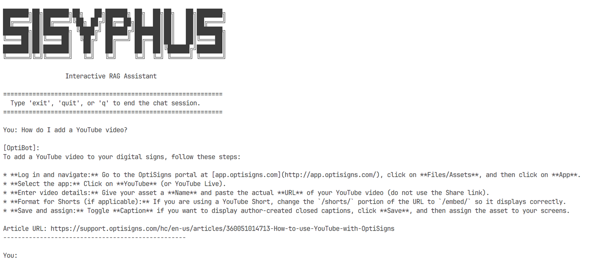

# 🌌 Sisyphus - Alphasphere

```text
███████╗██╗███████╗██╗   ██╗██████╗ ██╗  ██╗██╗   ██╗███████╗
██╔════╝██║██╔════╝╚██╗ ██╔╝██╔══██╗██║  ██║██║   ██║██╔════╝
███████╗██║███████╗ ╚████╔╝ ██████╔╝███████║██║   ██║███████╗
╚════██║██║╚════██║  ╚██╔╝  ██╔═══╝ ██╔══██║██║   ██║╚════██║
███████║██║███████║   ██║   ██║     ██║  ██║╚██████╔╝███████║
╚══════╝╚═╝╚══════╝   ╚═╝   ╚═╝     ╚═╝  ╚═╝ ╚═════╝ ╚══════╝
```

A robust, production-ready ETL (Extract, Transform, Load) and synchronization pipeline that automates the ingestion of support articles into a managed AI Vector Store (File Search Store) for high-performance Retrieval-Augmented Generation (RAG).

[](https://www.python.org/)
[](https://www.docker.com/)
[](https://github.com/Leminionn/sisyphus-alphasphere/actions)

---

## 📖 Architecture & Design Overview

`sisyphus-alphasphere` is structured with clean, modular, and resilient components:

*   **Extractor (Zendesk API):** Paginated support center crawling with built-in connection timeouts and backoff-retry adapters for rate-limit safety.
*   **Transformer (HTML to Markdown):** Normalizes raw HTML into clean, high-signal Markdown by stripping navigation, TOC blocks, image links, and advertisement wrappers. Injecting standardized header metadata (ID, Locale, Updated Date, Original URL) directly into the file.
*   **Delta Detector (Hashing):** Analyzes changes incrementally using SHA-256 hashing. Only new, modified, or deleted documents are synchronized, bypassing redundant embedding operations.
*   **Loader (Gemini File Search Store):** Handles API uploads, polls cloud operations with a safety timeout, and garbage-collects obsolete files on the vector search database.

---

## 🛠 Setup & Installation

### Prerequisites
- Python 3.12+
- Docker (optional, for containerized run)
- A Google Gemini API Key (accessed via [Google AI Studio](https://aistudio.google.com/))

### Local Installation

1. **Clone the repository**:
   ```bash
   git clone https://github.com/Leminionn/sisyphus-alphasphere.git
   cd sisyphus-alphasphere
   ```

2. **Set up virtual environment**:
   ```bash
   python -m venv venv
   # Windows (PowerShell):
   .\venv\Scripts\Activate.ps1
   # macOS/Linux:
   source venv/bin/activate
   ```

3. **Install dependencies**:
   ```bash
   pip install -r requirements.txt
   ```

4. **Configure environment variables**:
   Create a `.env` file by copying the template:
   ```bash
   cp .env.sample .env
   ```
   Open `.env` and fill in your `GEMINI_API_KEY`.

---

## 🚀 Run the Pipeline

### Local Run
Run the main script to trigger a scraping and vector-store sync:
```bash
python main.py
```

### Running via Docker
Build the docker image:
```bash
docker build -t sisyphus-sync .
```

Run the container (passing API key and mounting local data directory to preserve synchronization state):
```bash
# On Windows (PowerShell):
docker run --rm -v "${pwd}/data:/app/data" -e API_KEY="your_api_key_here" sisyphus-sync

# On macOS/Linux:
docker run --rm -v "$(pwd)/data:/app/data" -e API_KEY="your_api_key_here" sisyphus-sync
```

---

## 💬 RAG Query Assistant (CLI Tool)

We provide a complete interactive CLI utility `query_assistant.py` to chat with the grounded assistant and verify RAG performance.

### Configuration
In `.env`, you can customize the defaults:
- `GEMINI_STORE_NAME`: Display name of your file search store (default: `optibot-knowledge-base`).
- `GEMINI_MODEL`: Gemini model for reasoning (default: `gemini-2.5-flash`).

### Operations
*   **Single query (with citations):**
    ```bash
    python query_assistant.py -q "How do I add a YouTube video?" --citations
    ```
*   **Interactive chat session:**
    ```bash
    python query_assistant.py
    ```
*   **Dynamic model override at runtime:**
    If a model hits rate-limits or is temporarily unavailable, dynamically swap models using `-m` / `--model`:
    ```bash
    python query_assistant.py -m gemini-1.5-flash -q "How do I add a YouTube video?" --citations
    ```

---

## 🧠 Ingestion & Chunking Strategy

- **High-Signal Metadata Ingestion:** Documents are transformed into Markdown with standardized YAML-style header metadata (Article ID, locale, original URL, updated date) injected directly into the document stream.
- **Native Semantic Chunking:** We delegate chunking to Gemini's native managed File Search Store indexing engine. This parses the Markdown structures (headings, paragraphs, tables, lists) semantically, avoiding boundary-tearing and maintaining high grounding response accuracy.

---

## ☁️ Daily CI/CD Sync Job

The pipeline is pre-configured to run as a daily cron job using **GitHub Actions** (`.github/workflows/daily-sync.yml`).

### Stateful Execution in a Stateless CI/CD:
1. **Dockerized Run:** Every run builds the local `Dockerfile` and executes the pipeline inside the container, verifying Dockerization on every cycle.
2. **State Persistence:** The runner mounts the workspace `data/` directory to the container. If the sync pipeline makes any changes (adds/updates/deletes files or updates `state.json`), a final runner step commits and pushes the changes back to the repository using a bot account (`[skip ci]`).

- **Daily Job Logs:** [Link to GitHub Actions Run Logs](https://github.com/Leminionn/sisyphus-alphasphere/actions)

---

## 📸 Sanity Check Screenshot

Here is the assistant correctly answering the question **"How do I add a YouTube video?"** with grounding citations using our vector store:


